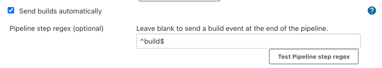
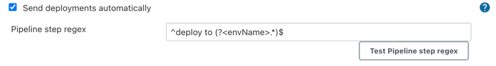

# Jenkins Plugin for Jira Cloud  

## Introduction

Atlassian has built and open-sourced a new Jenkins plugin that is
intended to be used specifically for integrating Jenkins with [Jira
Software Cloud](https://www.atlassian.com/software/jira) and [Jira
Service Desk Cloud](https://www.atlassian.com/software/jira/service-desk). This plugin
exists to provide a free, easy, secure, and reliable way to connect
build and deployment information from your Jenkins server to your Jira
Software Cloud sites.

It uses OAuth Credentials (2LO), which site admins can create in
their Jira Cloud sites. During creation, each OAuth Credential is explicitly 
scoped for additional security, therefore it can only be used for
sending build and deployment information and associate this information
with Jira issues. This provides your Jenkins server, operating behind the
firewall, a mechanism to securely send data one-way, from Jenkins to your 
Jira Cloud site, without requiring opening up any ports in your firewall.

This plugin provides a straight-forward way to start using Jenkins and 
Jira Software Cloud together to help your team better track and collaborate 
on their work.

If you have any questions,
please <https://support.atlassian.com/contact/>, or help contribute to
the [open-source
plugin](https://github.com/jenkinsci/atlassian-jira-software-cloud-plugin)
by raising an issue or a PR! Also, you can read more about [OAuth
Credentials](https://confluence.atlassian.com/adminjiracloud/integrating-with-self-hosted-tools-using-oauth-972355470.html)
and [Jenkins
plugin](https://confluence.atlassian.com/adminjiracloud/integrate-jira-software-cloud-with-jenkins-972355471.html)
in Atlassian documentation.

## What is the value?

This plugin gives your team visibility and insight of your CI/CD pipelines, 
specifically around builds and deployments related to Jira issues. 
As long as [Jira issue keys (e.g. "TEST-123")](https://support.atlassian.com/jira-software-cloud/docs/reference-issues-in-your-development-work/) 
are used in commit messages and branch names, the plugin will automatically 
connect builds and deployments from Jenkins pipelines to Jira issues.

-   for **software engineers**, this [removes the need](https://support.atlassian.com/jira-software-cloud/docs/view-development-information-for-an-issue/) 
    to manually reference Jenkins pipelines in Jira issues in UI, saving time 
    and double-entry.
    
-   for **QA engineers** the plugin helps to identify:
      - failing builds
      - whether a particular deployment has reached some test environment
    
-   for **product managers**, **team leads**, and **QA engineers** the
    plugin gives visibility over things like:
      - whether a particular feature was deployed to production and available to customers
      - [the timeline](https://support.atlassian.com/jira-software-cloud/docs/enable-deployments/) of releases 
      - etc
    
The builds and deployments are also [become available](https://support.atlassian.com/jira-software-cloud/docs/advanced-search-reference-jql-developer-status/) 
for referencing with Jira Query Language (JQL).

[OAuth Credentials (2LO)](https://support.atlassian.com/jira-cloud-administration/docs/integrate-with-self-hosted-tools-using-oauth/) 
are used to securely integrate Jira Cloud sites and Jenkins instances 
together. They can be managed by Jira site administrators only and are 
used for secure, unidirectional communication (Jenkins calling Jira via 
HTTP) between them without need in opening any "holes" in your firewall.


OAuth Credentials - Showing an example credential scoped to be used to
send build and deployment information via APIs. This Client ID and
Secret would be used with this Jenkins plugin via the configuration.


Jira issue detail view, showing the development and releases panel on
the right-hand column. You can click into each of these to see more
details.


Jira issue detail view, after clicking into the Releases glance summary
('Production" in the previous image) you can see what repos,
environments, and deployments this feature is associated with. Here we
see it has indeed gone to our production environment in deployment \#4. 


Using the Jira Query Language (JQL), you can search across issues that
have been deployed to an environment type or a specific environment
name. You can mix and match this information with existing data like
epics, versions, components, labels, and much more.

  

------------------------------------------------------------------------

## How to get started

### In Jira Software Cloud site

Create OAuth credentials in Jira for Jenkins:

1.  Navigate to**Jira home \> Jira settings \> Apps**.

2.  Select **OAuth credentials**.

3.  Select **Create credentials**.

4.  Enter the following details:

    -   *App name* - some meaninful name of your Jenkins instance (e.g. "My 
        Jenkins")

    -   *App logo* - a URL to the Jenkins logo that should be used as an
        icon in Jira UI (e. g. "`https://jenkins.yourcompany.com/logo.png`")

    -   *Server base URL* - the URL of your Jenkins server (e.g. 
        `https://jenkins.yourcompany.com`). It doesn't need to be a publicly 
        available URL and is only used in Jira UI to render links.

    -   give the following permissions:
        - Deployments
        - Builds


### In Jenkins

Install the Jenkins plugin:

1.  Login to your Jenkins server and navigate to the Plugin Manager.

2.  Select **"Available"** tab and search for *"Atlassian Jira Software
    Cloud"* as the plugin name. Install it.
    1.  NOTE: The plugin sources [could be found here](https://github.com/jenkinsci/atlassian-jira-software-cloud-plugin).

Set up Jira credentials: 

1.  In Jenkins, go to **Manage Jenkins \> Configure System** screen
    and scroll to *Jira Software Cloud integration* section.

2.  Select **Add Jira Cloud Site \> Jira Cloud Site**. 

3.  Enter the following details:

    -   Site name: the hostname of your Jira Cloud site (e. g. 
        `yourcompany.atlassian.net`)

    -   Client ID: copy-paste value from **OAuth credentials** screen

    -   Secret: select Add \> Jenkins:

        -   for *Kind*, select **Secret text**

        -   for *Secret*, copy-paste value from **OAuth credentials** screen
    
        -   for *Id*, provide a meaningful short name (e.g. `yourcompany-jira-oauth-secret`)

        -   for *Description*, provide a helpful description.

4.  Click **Test connection** to make sure the provided credentials are 
    correct.

## Sending build and deployment events to Jira

The main use case of this plugin is to send build and deployment events to Jira. The plugin will look for Jira issue keys in the name of the branch for which a pipeline is run. If it finds issue keys, it will send build and deployment events to Jira to make them visible in Jira's issue and deployment views.

### Sending builds automatically

Starting with version 2.0.0 of the plugin (not yet available!), you can configure the plugin to automatically send builds events without having to add anything to your Jenkinsfiles:



If you enable the checkbox "Send builds automatically", the plugin will send an "in progress" build event to Jira once a pipeline run has started and a "success" or "failure" build event once the pipeline has finished successfully  or stopped due to an error.

If you additionally specify a regular expression for builds, the plugin will only send a build event to Jira once a build step with a matching name has been finished.

The regular expression `^build$` would match the `build` stage in the following Jenkinsfile, for example:

```groovy
pipeline {
    agent  any
    stages {
        stage('build') {
            steps {
                echo  'build done'
            }
        }
    }
}
```

Whenever the pipeline in this Jenkinsfile runs, it will send build events to all configured Jira Cloud sites on start and finish of the `build` stage.

### Sending deployments automatically

Starting with version 2.0.0 of the plugin (not yet available!), you can configure the plugin to automatically send deployment events without having to add anything to your Jenkinsfiles:



If you enable the checkbox "Send deployments automatically", the plugin will send an "in progress" deployment event to Jira once a build step with a name matching the specified regular expression has started, and a "success" or "failure" deployment event once that build step has finished.

For this to work, the deployment steps in your Jenkinsfile have to contain the environment name in their name. The regular expression must contain the fragment `(?<envName>.*)` to match the environment name so that the plugin can extract the environment name from the build step names.

Let's look at an example Jenkinsfile:

```groovy
pipeline {
    agent  any
    stages {
        stage('deployments') {
            parallel {
                stage('deploy to stg') {
                    steps {
                        echo 'stg deployment done'
                    }
                }
                stage('deploy to prod') {
                    steps {
                        echo 'prod deployment done'
                    }
                }
            }
        }
    }
}
```

If the checkbox "Send deployments automatically" is enabled and the regular expression is set to `^deploy to (?<envName>.*)$`, a run of the above Jenkinsfile will send "in progress" deployment events for the `stg` and `prod` environments to all configured Jira Cloud sites, followed by respective "success" deployment events once the build steps are finished.

### Sending builds explicitly

If you want more control over when to send build events, you can use the `jiraSendBuildInfo` build step:

```groovy
pipeline {
     agent any
     stages {
         stage('Build') {
             steps {
                 echo 'Building...'
             }
             post {
                 always {
                     // previous to version 2.0.0 you must provide parameters to this command (see below)!
                     jiraSendBuildInfo() 
                 }
             }
         }
     }
 }
```

This will send a "success" or "failure" build event to all configured Jira Cloud sites after the `Build` stage has finished successfully or with an error. 

By default, the branch name to extract Jira issue keys from is retrieved from the Jenkins API, however you can specify it yourself. 

You can also specify a Jira site URL to instruct the plugin to send the build event to only this Jira site instead of to all configured Jira sites:

```groovy
pipeline {
     agent any
     stages {
         stage('Build') {
             steps {
                 echo 'Building...'
             }
             post {
                 always {
                     jiraSendBuildInfo site: 'example.atlassian.net', branch: 'TEST-123-awesome-feature'
                 }
             }
         }
     }
 }
```

### Sending deployments explicitly

If you want more control over when to send deployment events, you can use the `jiraSendDeploymentInfo` build step:

```groovy
pipeline {
     agent any
     stages {
         stage('Deploy - Staging') {
             when {
                 branch 'master'
             }
             steps {
                 echo 'Deploying to Staging from master...'
             }
             post {
                 always {
                     jiraSendDeploymentInfo environmentId: 'us-stg-1', environmentName: 'us-stg-1', environmentType: 'staging'
                 }
             }
         }
         stage('Deploy - Production') {
            when {
                branch 'master'
            }
            steps {
                echo 'Deploying to Production from master...'
            }
            post {
                always {
                    jiraSendDeploymentInfo environmentId: 'us-prod-1', environmentName: 'us-prod-1', environmentType: 'production'
                }
            }
         }
     }
 }
```

This will send a "success" or "failure" deployment event to all configured Jira sites at the end of the stages `Deploy - Staging` and `Deploy - Production`. 

You **must** provide the parameters `environmentId`, `environmentName`, and `environmentType`.

You can also provide the parameter `site` to specify to send the deployment events to a single Jira site instead of all configured Jira sites. 

Also, you can specify a branch with the `branch` parameter to define the branch from which to extract Jira issue keys to connect the deployments with.

When multiple Jira sites are connected to a Jenkins server, the `site` 
    parameter is required for `jiraSendDeploymentInfo` with `enableGating:true`.
   More details about Deployment Gating can be found [here](https://support.atlassian.com/jira-service-management-cloud/docs/use-deployment-gating-with-jenkins/).


### Example of a complete Jenkinsfile

You can mix build and deployments as in the Jenkinsfile below:

```groovy
pipeline {
     agent any
     stages {
         stage('Build') {
             steps {
                 echo 'Building...'
             }
             post {
                 always {
                     jiraSendBuildInfo site: 'example.atlassian.net'
                 }
             }
         }
         stage('Deploy - Staging') {
             when {
                 branch 'master'
             }
             steps {
                 echo 'Deploying to Staging from master...'
             }
             post {
                 always {
                     jiraSendDeploymentInfo environmentId: 'us-stg-1', environmentName: 'us-stg-1', environmentType: 'staging'
                 }
             }
         }
         stage('Deploy - Production') {
            when {
                branch 'master'
            }
            steps {
                echo 'Deploying to Production from master...'
            }
            post {
                always {
                    jiraSendDeploymentInfo environmentId: 'us-prod-1', environmentName: 'us-prod-1', environmentType: 'production'
                }
            }
         }
     }
 }
```

### Creating change requests in Jira Service Management

To automatically create change requests in Jira Service Management from Jenkins, 
you first need to enable Change management in your Information Technology
Service Management (ITSM) project.

To connect Jenkins to your Jira Service Management Cloud project:

1. First, complete the Jira Cloud and Jenkins set-up steps listed above

2. In your Jira Service Management ITSM project, navigate to 
   **Project settings > Change management**

3. Select **Connect Pipeline > Jenkins**, then copy the Service ID at the 
   end of the set-up flow

4. Go to Jenkins, select the Pipeline you want to associate with this 
   service, and select **Build with Parameters**

5. Paste the Service ID from the Change management set-up flow into the 
   Build with Parameters field

When you run the pipeline, it will automatically create a change request 
in Jira Service Management.

For more information about deployment tracking and deployment gating please 
refer to Atlassian documentation:
 - [Deployment Tracking](https://support.atlassian.com/jira-service-management-cloud/docs/use-deployment-tracking-with-jenkins/)
 - [Deployment Gating](https://support.atlassian.com/jira-service-management-cloud/docs/use-deployment-gating-with-jenkins/)


If you have any questions, please [contact us](https://support.atlassian.com/contact/).
