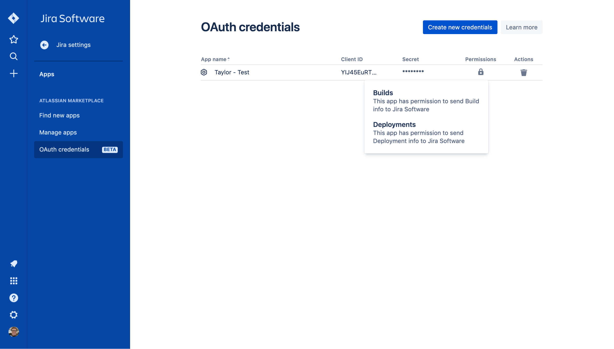
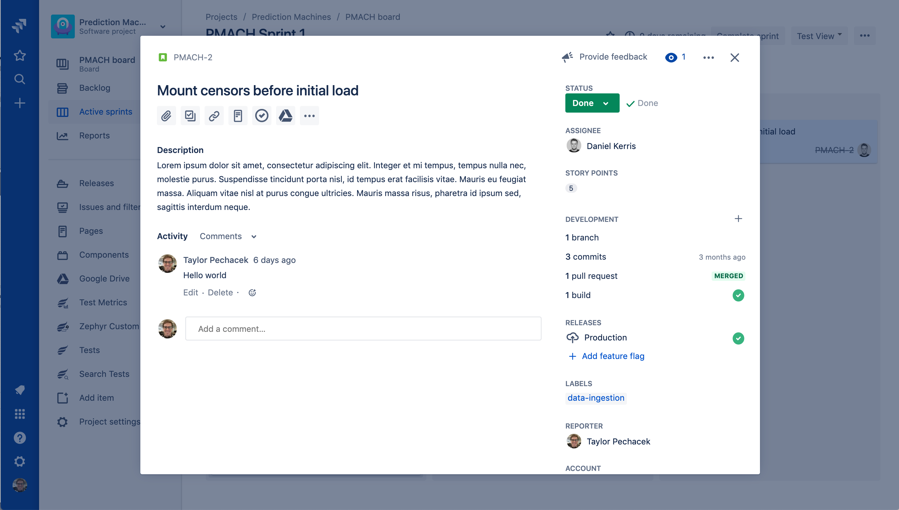
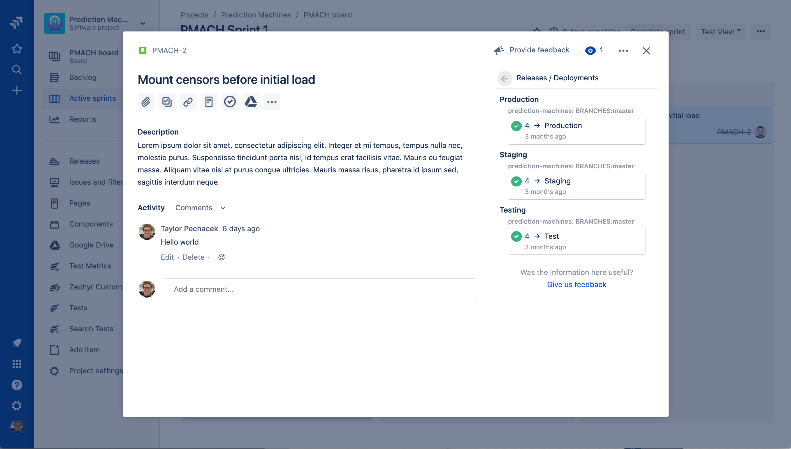
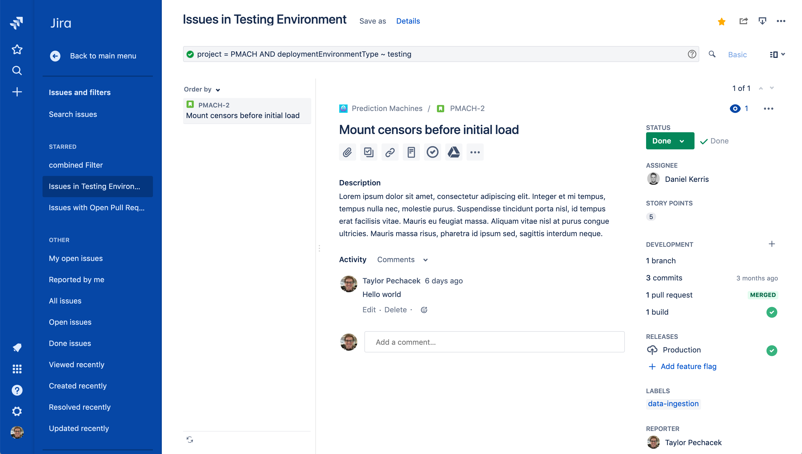

  

# Introduction

Atlassian has built and open-sourced a new Jenkins plugin that is
intended to be used specifically for integrating Jenkins with [Jira
Software Cloud](https://www.atlassian.com/software/jira) and [Jira
Service Desk Cloud](https://www.atlassian.com/software/jira/service-desk). This plugin
exists to provide a free, easy, secure, and reliable way to connect
build and deployment information from your Jenkins server to your Jira
Software Cloud site.  

It uses new OAuth Credentials (2LO), which site admins can create in
their Jira Cloud site. This OAuth Credential is explicitly scoped, when
creating it, for additional security, so that it can only be used to
send build and deployment information and associate that information
with Jira issues. This gives your Jenkins server, operating behind the
firewall, a mechanism to securely send data, one-way, to your Jira Cloud
site without having to open up any ports in your firewall.

There are additional Jira ↔ Jenkins integrations that provide some
additional capabilities on top of this, which we encourage you to try
out if you are looking for additional features. Otherwise, if you are
just getting started, you have find the right tool for the job. This
plugin will provide a very straight-forward way to get started and start
using Jenkins and Jira Software Cloud together to help your team better
track and collaborate on their work.

If you have any questions,
please <https://support.atlassian.com/contact/>, or help contribute to
the [open-source
plugin](https://github.com/jenkinsci/atlassian-jira-software-cloud-plugin)
by raising an issue or PR! Also, you can read more about [OAuth
Credentials](https://confluence.atlassian.com/adminjiracloud/integrating-with-self-hosted-tools-using-oauth-972355470.html)
and the [Jenkins
plugin](https://confluence.atlassian.com/adminjiracloud/integrate-jira-software-cloud-with-jenkins-972355471.html)
via Atlassian documentation pages.

  

------------------------------------------------------------------------

# What is the value?

By using this integration your team will gain visibility and insight
into your CI/CD pipeline, specifically all builds and deployments,
related to Jira issues. As long as you are using Jira Issue keys
("TEST-123") in your commit messages and branch names, the Jenkins
integrate will automatically connect related builds and deployments as
run your pipelines. 

-   For **software engineers**, this removes the need to manually update
    Jira via going into the UI saving time and double-entry. 
-   For **product managers,** **team leads**, and **QA engineers** this
    gives visibility into things like failing builds or whether or not a
    feature went to a staging environment and is actually ready for QA.
    You can look at a specific issue or search across them using the
    Jira Query Language (JQL). 

Additionally, you can use OAuth Credentials (2LO) to securely integrate
these tools together. This credential is tied to a specific Jira site,
can be managed by site administrators only, and is used to communicate
between your Jira Software Cloud site and Jenkins without having to open
any holes in your firewall. 

  

  



  

  

  

  

OAuth Credentials - Showing an example credential scoped to be used to
send build and deployment information via APIs. This Client ID and
Secret would be used with this Jenkins plugin via the configuration.

  

  

  

  

  



  

  

  

  

Jira issue detail view, showing the development and releases panel on
the right-hand column. You can click into each of these to see more
details.

  

  

  

  



  

  

  

  

Jira issue detail view, after clicking into the Releases glance summary
('Production" in the previous image) you can see what repos,
environments, and deployments this feature is associated with. Here we
see it has indeed gone to our production environment in deployment \#4. 

  

  

  

  



  

  

  

Using the Jira Query Language (JQL), you can search across issues that
have been deployed to an environment type or a specific environment
name. You can mix and match this information with existing data like
epics, versions, components, labels, and much more.

  

  

  

  

------------------------------------------------------------------------

# How to get started

#### **In Jira Software Cloud**

**Create OAuth credentials in Jira for Jenkins**

1.  Navigate to **Jira home** \> **Jira settings **\>** Apps**.

2.  Select **OAuth credentials**.

3.  Select **Create credentials**.

4.  Enter the following details:

    -   *App name* - Jenkins

    -   *App logo* - A URL to the Jenkins logo, which will be used as an
        icon in the list of credentials.
        Eg: <https://jenkins.yourcompany.com/logo.png>

    -   *Server base URL* - The URL to your Jenkins server.
        Eg: [https://jenkins.yourcompany.com](https://jenkins.yourcompany.com/ "https://jenkins.yourcompany.com")

#### **In Jenkins**

**Install the Jenkins plugin**

1.  Login to your Jenkins server and navigate to the Plugin Manager.

2.  Select the 'Available' tab and search for 'Atlassian Jira Software
    Cloud' as the plugin name then install it.
    1.  The open-source plugin is hosted at on the Jenkins GitHub
        account. [You can check it out
        here](https://github.com/jenkinsci/atlassian-jira-software-cloud-plugin).

  

**Set up Jenkins credentials**

1.  In Jenkins, go to **Manage Jenkins** \> **Configure System **screen
    and scroll to the *Jira Software Cloud integration* section.

2.  Select **Add Jira Cloud Site **\> **Jira Cloud Site**. The *Site
    name*,* ClientID*,* *and* Secret fields *display*.*

3.  Enter the following details:

    -   Site name: The URL for your Jira Cloud site, for
        example *[yourcompany.atlassian.net](http://yourcompany.atlassian.net/)*.

    -   Client ID: Copy from **OAuth credentials** screen (Client ID
        column).

    -   Secret: Select Add \> Jenkins.

        -   For *Kind*, select **Secret text**.

        -   For *Secret*, copy from **OAuth credentials** screen (Secret
            column).

        -   For *Description*, provide a helpful description

4.  Select **Test connection** to make sure your credentials are valid
    for your Jira site.

  

# How to use the integration

**To start using the integration:**

1.  Go into a specific pipeline in Jenkins
    (  Note:
    Your pipeline must be a 'Multibranch Pipeline' ).

2.  From the left-hand menu, select **Pipeline Syntax**.

3.  In the Snippet Generator,
    select **jiraSendDeploymentInfo** or **jiraSendBuildInfo** from the
    dropdown list of Sample Steps and fill in the relevant details.

4.  Select **Generate Pipeline Script** and copy/paste the output into
    your *Jenkinsfile* on the relevant Repository you are using. This
    will be used to notify Jira when you run that pipeline on that repo.

  

**For sending build information**

This is an example snippet of a very simple ‘build’ stage set up in
a *Jenkinsfile*. After the pipeline is run, it will post the build
information to your Jira Cloud site by looking at the branch name. If
there is a Jira issue key (e.g. “TEST-123”) in the branch name, it will
send the data over to Jira.

  

**Jenkinsfile example**

``` syntaxhighlighter-pre
pipeline {
     agent any
     stages {
         stage('Build') {
             steps {
                 echo 'Building...'
             }
             post {
                 always {
                     jiraSendBuildInfo site: 'example.atlassian.net'
                 }
             }
         }
     }
 }
```

By default, the branch name is fetched from the Jenkins SCM API.
Alternatively, the branch name can be explicitly specified as an
additional **branch** parameter. You can also use the branch parameter
to post the build result to a specific Jira issue.

``` syntaxhighlighter-pre
pipeline {
     agent any
     stages {
         stage('Build') {
             steps {
                 echo 'Building...'
             }
             post {
                 always {
                     jiraSendBuildInfo site: 'example.atlassian.net', branch: 'TEST-123-awesome-feature'
                 }
             }
         }
     }
 }
```

  

  

**For sending deployment information**

This is an example snippet of two satges that runs on any change to the
staging or master branch. Again, we use a post step to send deployment
data to Jira and the relevant issues. Here,
the **environmentId**, **environmentName**, and **environmentType** need
to be set to whatever you want to appear in Jira.

  

**Jenkinsfile example**

``` syntaxhighlighter-pre
pipeline {
     agent any
     stages {
         stage('Deploy - Staging') {
             when {
                 branch 'master'
             }
             steps {
                 echo 'Deploying to Staging from master...'
             }
             post {
                 always {
                     jiraSendDeploymentInfo site: 'example.atlassian.net', environmentId: 'us-stg-1', environmentName: 'us-stg-1', environmentType: 'staging'
                 }
             }
         }
         stage('Deploy - Production') {
            when {
                branch 'master'
            }
            steps {
                echo 'Deploying to Production from master...'
            }
            post {
                always {
                    jiraSendDeploymentInfo site: 'example.atlassian.net', environmentId: 'us-prod-1', environmentName: 'us-prod-1', environmentType: 'production'
                }
            }
         }
     }
 }
```

  

  

The entire *Jenkinsfile* may look something like this. This is only
meant to represent an example of what the Jira snippets could look like
within a stage or step.

  

**Jenkinsfile example**

``` syntaxhighlighter-pre
pipeline {
     agent any
     stages {
         stage('Build') {
             steps {
                 echo 'Building...'
             }
             post {
                 always {
                     jiraSendBuildInfo site: 'example.atlassian.net'
                 }
             }
         }
         stage('Deploy - Staging') {
             when {
                 branch 'master'
             }
             steps {
                 echo 'Deploying to Staging from master...'
             }
             post {
                 always {
                     jiraSendDeploymentInfo site: 'example.atlassian.net', environmentId: 'us-stg-1', environmentName: 'us-stg-1', environmentType: 'staging'
                 }
             }
         }
         stage('Deploy - Production') {
            when {
                branch 'master'
            }
            steps {
                echo 'Deploying to Production from master...'
            }
            post {
                always {
                    jiraSendDeploymentInfo site: 'example.atlassian.net', environmentId: 'us-prod-1', environmentName: 'us-prod-1', environmentType: 'production'
                }
            }
         }
     }
 }
```

# Link Jira Service Desk Cloud with Jenkins

To automatically create change requests in Jira Service Desk from Jenkins, you first need to enable Change management in your Information Technology Service Management (ITSM) project.

To connect Jenkins to your Jira Service Desk Cloud project:

1. First, complete the Jira Cloud and Jenkins set-up steps listed above

2. In your Jira Service Desk ITSM project, navigate to **Project settings > Change management**

3. Select **Connect Pipeline > Jenkins**, then copy the Service ID at the end of the set-up flow

4. Go to Jenkins, select the Pipeline you want to associate with this service, and select **Build with Parameters**

5. Paste the Service ID from the Change management set-up flow into the Build with Parameters field

When you run the pipeline, it will automatically create a change request in Jira Service Desk.  

If you have any questions,
please <https://support.atlassian.com/contact/> and they will route it
to the correct team to help you.
